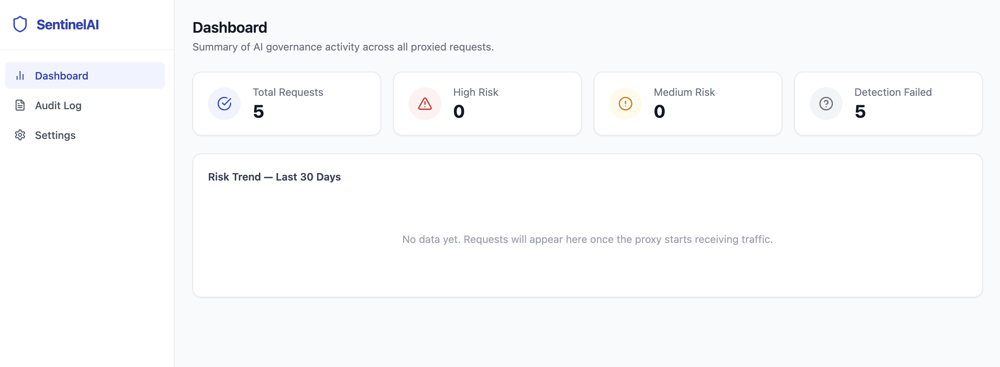
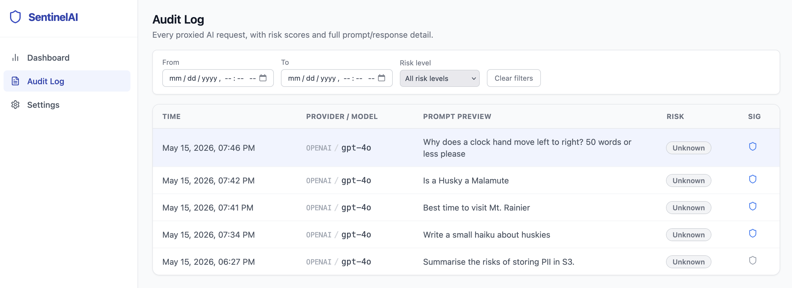
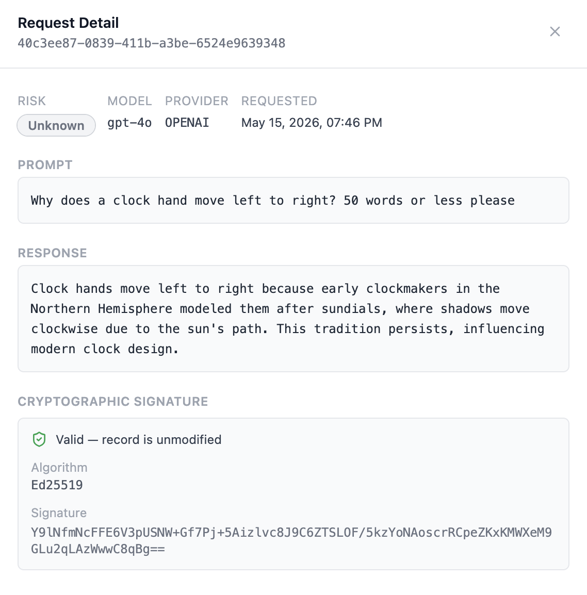
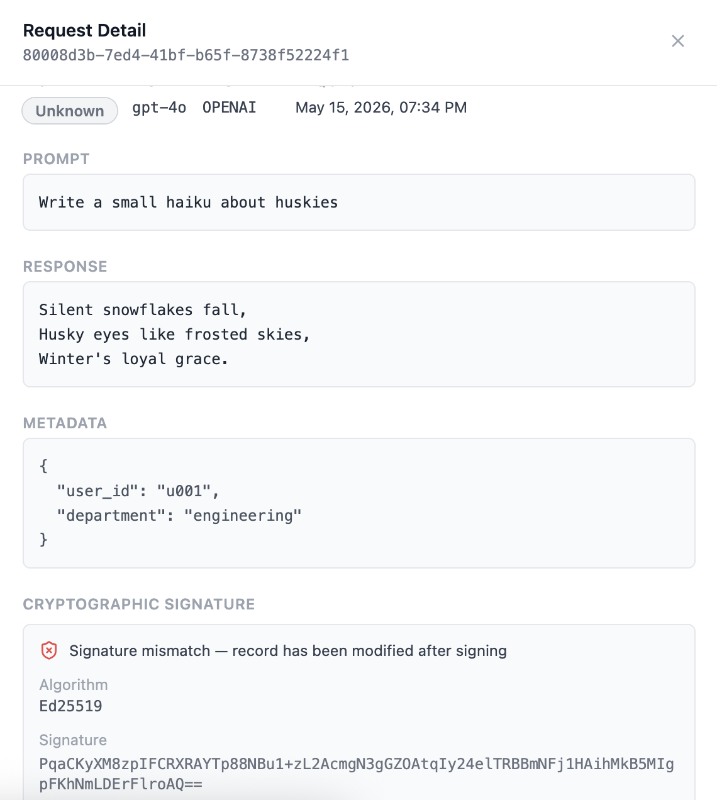

# SentinelAI

[](https://github.com/vsrohithc/sentinelai/actions/workflows/ci.yml)
[](LICENSE)
[](https://openjdk.org/projects/jdk/21/)
[](https://spring.io/projects/spring-boot)
[](https://react.dev/)
[](https://docs.docker.com/compose/)

[](https://gitpod.io/#https://github.com/vsrohithc/sentinelai)
[](https://codespaces.new/vsrohithc/sentinelai)

**SentinelAI is AWS X-Ray for agentic AI.** Every agent call, tool execution, model response, and memory read — traced, signed, and audit-ready.

An open-source AI governance proxy that sits between your application and any AI provider (OpenAI, Anthropic, Gemini, Azure OpenAI). Every prompt and response is logged, cryptographically signed, and surfaced in a real-time dashboard — giving you a tamper-evident audit trail for compliance, security, and oversight.

---

## Screenshots





<table>
<tr>
<td></td>
<td></td>
</tr>
<tr>
<td align="center"><em>Signature verified — record unmodified</em></td>
<td align="center"><em>Signature invalid — record tampered</em></td>
</tr>
</table>

---

## What it does

- **Proxy** — forwards prompts to OpenAI, Anthropic, Gemini, or Azure OpenAI and returns the response transparently
- **Audit** — persists every prompt, response, and metadata to PostgreSQL asynchronously (zero added latency)
- **Sign** — every audit record is signed with Ed25519 at write time; tampering is detectable via `GET /api/logs/{id}/verify`
- **Score (optional, pluggable)** — every prompt can be scored for injection risk by an in-process rule-based detector, a third-party HTTP detection API, or skipped entirely. Operator's choice; default is "skip"
- **Dashboard** — React UI with paginated audit log, risk filtering, signature status badge, and daily risk trend chart
- **Govern** — per-tenant license tiers with configurable log retention (7 / 30 / 90 / 365 days)
- **Harden** — rate limiting (Bucket4j), API key auth, CORS, security headers, structured JSON logging

---

## Detection strategies (pluggable)

SentinelAI's primary value is the **audit trail** — every prompt and response, persisted to a database you control. Scoring those prompts for injection risk is an **optional, pluggable** capability layered on top. Operators pick the strategy they want via `DETECTION_STRATEGY`:

| Strategy | What it does | Data leaves your environment? | Per-request cost |
|---|---|---|---|
| **`none`** *(default)* | No scoring. Audit row is persisted with `risk_score = NULL`. | No | $0 |
| **`rules`** | In-process regex / keyword scorer covering the well-known injection patterns (ignore-instructions, DAN, jailbreak, role-override, bypass-filter, etc.). | No | $0 |
| **`external`** | POSTs each prompt to a third-party detection HTTP API (Lakera Guard, Protect AI, or your own service). | **Yes** — the prompt text is sent to the configured URL. | Vendor pricing |

The contract is the same for every strategy: the audit row is persisted regardless, and any detection failure resolves to `risk_score = NULL` so the proxy request never fails because of detection.

This is the same shape as plugging an APM agent into your app: SentinelAI gives you the audit infrastructure, the customer chooses (or skips) the detector that classifies what they see.

---

## Architecture

```
Your App -> POST /api/proxy -> SentinelAI Backend --+--> AI Provider (OpenAI / Anthropic / Gemini / Azure)
                                                    +--> Detection API (parallel, non-blocking)
                                                           | async
                                                        PostgreSQL
                                                           |
                                                React Dashboard (GET /api/logs)
```

See [docs/architecture.md](docs/architecture.md) for the full component diagram and design decisions.

---

## Quickstart — one command

> **Only requirements:** [Git](https://git-scm.com/downloads) and [Docker Desktop](https://www.docker.com/products/docker-desktop/) — no API keys, no Java, no Node, no config.

```bash
git clone https://github.com/vsrohithc/sentinelai.git
cd sentinelai
docker compose up --build -d
```

That's it. Docker pulls all images, builds the app, seeds the database with 8 realistic test requests, and starts the dashboard.

Open **http://localhost:3000** — the audit log is already populated.

```
# Stop the stack
docker compose down

# Stop and wipe all data (fresh start)
docker compose down -v
```

> **Windows users:** Run the commands above in PowerShell or Windows Terminal with Docker Desktop running. No additional tools needed.

---

## Full local development setup

### Prerequisites

| Tool | Minimum version | Download |
|---|---|---|
| Git | any | [git-scm.com](https://git-scm.com/downloads) |
| Java (JDK) | 21 | [Adoptium Temurin 21](https://adoptium.net/temurin/releases/?version=21) |
| Maven | 3.9 | [maven.apache.org](https://maven.apache.org/download.cgi) |
| Node.js | 20 | [nodejs.org](https://nodejs.org/en/download) |
| Docker Desktop | 4.x (includes Compose v2) | [docker.com](https://www.docker.com/products/docker-desktop/) |
| Make | any | macOS: `brew install make` · Windows: install [Chocolatey](https://chocolatey.org/install) then `choco install make` · Linux: `apt install make` |

### 1 — Clone and configure

```bash
git clone https://github.com/vsrohithc/sentinelai.git
cd sentinelai
cp .env.example .env
```

Open `.env` and fill in:

```dotenv
# Required — at least one AI provider
OPENAI_API_KEY=sk-...

# Required — your injection detection service URL and key
DETECTION_API_URL=https://your-detection-api.example.com
DETECTION_API_KEY=...

# Optional — leave blank to disable API key auth on the proxy endpoint
SENTINEL_API_KEYS=
```

### 2 — Start the database

```bash
make db          # starts a Dockerised PostgreSQL on port 5432
```

### 3 — Start the backend

```bash
make backend     # runs: cd backend && mvn spring-boot:run
```

The backend starts on **http://localhost:8080**. Flyway migrations run automatically.

### 4 — Start the frontend

```bash
make frontend    # runs: cd frontend && npm install && npm run dev
```

The dashboard opens on **http://localhost:3000** (Vite dev server with HMR).

### 5 — Run tests

```bash
make test        # runs all backend unit + integration tests
```

---

## Testing with real API keys

The quickstart demo uses WireMock stubs — nothing calls a real AI provider. To test with real keys:

```bash
# 1. Start PostgreSQL only
make db

# 2. Copy and fill in your keys
cp .env.example .env
# Edit .env — set OPENAI_API_KEY (or whichever provider you want to test)

# 3. Start the backend and frontend
make backend    # new terminal
make frontend   # new terminal
```

The backend at `http://localhost:8080` will now forward requests to the real provider.

> **No detection API?** Leave `DETECTION_API_URL` blank. Risk scores will show as N/A in the dashboard — everything else (real AI call, database write, dashboard) works normally.

---

## Try it — send your first request

```bash
curl -X POST http://localhost:8080/api/proxy \
  -H "Content-Type: application/json" \
  -d '{
    "prompt": "Summarise the risks in this contract.",
    "model": "gpt-4o",
    "provider": "OPENAI",
    "metadata": { "user_id": "u123", "department": "legal" }
  }'
```

Response:

```json
{
  "requestId": "a3f7c2d1-...",
  "model": "gpt-4o",
  "responseText": "The key risks are..."
}
```

The request appears in the dashboard at http://localhost:3000 immediately.

### Supported providers

| Provider | `provider` value | Model examples |
|---|---|---|
| OpenAI | `OPENAI` | `gpt-4o`, `gpt-3.5-turbo` |
| Anthropic | `ANTHROPIC` | `claude-3-5-sonnet-20241022` |
| Google Gemini | `GEMINI` | `gemini-1.5-pro` |
| Azure OpenAI | `AZURE_OPENAI` | deployment name in Azure |

---

## Production deployment

```bash
make build       # builds backend JAR + frontend bundle
make prod        # starts full prod stack via docker-compose.prod.yml
```

See [docs/deployment.md](docs/deployment.md) for the full production deployment guide.

---

## API reference

Full API documentation is at [docs/api.md](docs/api.md). Key endpoints:

| Method | Path | Description |
|---|---|---|
| `POST` | `/api/proxy` | Proxy a prompt to an AI provider |
| `GET` | `/api/logs` | Paginated audit log with filters |
| `GET` | `/api/logs/{id}` | Single audit log entry |
| `GET` | `/api/logs/{id}/verify` | Verify the Ed25519 signature of an audit record |
| `GET` | `/api/logs/public-key` | Ed25519 public key in PEM format for offline verification |
| `GET` | `/api/health` | Service health (DB + detection API) |
| `GET` | `/api/license/info` | License tier and retention info |

---

## Configuration reference

All configuration is via environment variables. Copy `.env.example` for a full annotated list.

| Variable | Default | Description |
|---|---|---|
| `OPENAI_API_KEY` | — | OpenAI API key |
| `ANTHROPIC_API_KEY` | — | Anthropic API key |
| `GEMINI_API_KEY` | — | Google AI Studio API key |
| `AZURE_OPENAI_ENDPOINT` | — | Azure OpenAI resource URL |
| `DETECTION_STRATEGY` | `none` | One of `none` / `rules` / `external`. See [Detection strategies](#detection-strategies-pluggable). |
| `DETECTION_API_URL` | — | External detection URL (only used when `DETECTION_STRATEGY=external`) |
| `DETECTION_API_KEY` | — | External detection API key |
| `SENTINEL_API_KEYS` | _(disabled)_ | Comma-separated proxy API keys |
| `RATE_LIMIT_CAPACITY` | `60` | Max burst tokens per IP |
| `RATE_LIMIT_REFILL_PER_MINUTE` | `60` | Token refill rate (~1 req/sec sustained) |
| `CORS_ALLOWED_ORIGINS` | `http://localhost:3000` | Allowed CORS origins |
| `DB_URL` | `jdbc:postgresql://localhost:5432/sentinelai` | PostgreSQL JDBC URL |
| `SIGNING_PRIVATE_KEY` | _(disabled)_ | Base64-encoded Ed25519 private key PEM. Omit to disable signing. |
| `SIGNING_PUBLIC_KEY` | _(disabled)_ | Base64-encoded Ed25519 public key PEM. Required when private key is set. |

Generate a keypair with:

```bash
openssl genpkey -algorithm ed25519 -out private.pem
openssl pkey -in private.pem -pubout -out public.pem
export SIGNING_PRIVATE_KEY=$(base64 -i private.pem)
export SIGNING_PUBLIC_KEY=$(base64 -i public.pem)
```

---

## Project structure

```
sentinelai/
├── backend/                        # Spring Boot 3.2 / Java 21 / WebFlux
│   ├── src/main/java/com/sentinelai/
│   │   ├── config/                 # WebClient, rate limiting, CORS, async
│   │   ├── controller/             # ProxyController, LogController, HealthController
│   │   ├── dto/                    # Request/response DTOs
│   │   ├── exception/              # GlobalExceptionHandler
│   │   ├── filter/                 # RequestContextFilter, ApiKeyFilter, RateLimitFilter
│   │   ├── model/                  # JPA entities (PromptLog)
│   │   ├── repository/             # Spring Data JPA repositories
│   │   └── service/                # ProxyService, AuditService, LogQueryService, SigningService, ...
│   └── src/main/resources/
│       ├── application.yml         # Main configuration (env-var driven)
│       ├── db/migration/           # Flyway SQL migrations (V1-V4)
│       └── logback-spring.xml      # Console (dev) + JSON (prod) logging
├── frontend/                       # React 18 + TypeScript + Vite + Tailwind
│   └── src/
│       ├── api/                    # Typed API client
│       ├── components/             # Shared UI components
│       └── pages/                  # Dashboard, AuditLog, Settings
├── docker/
│   ├── docker-compose.yml          # Local development stack
│   ├── docker-compose.prod.yml     # Production stack (with Nginx)
│   └── docker-compose.demo.yml     # One-click demo (WireMock + seed data)
├── docs/
│   ├── architecture.md             # System design and component diagram
│   ├── api.md                      # Full REST API reference
│   ├── deployment.md               # Production deployment guide
│   └── img/                        # Dashboard screenshots
├── compose.yaml                    # One-command quickstart (docker compose up --build -d)
├── .env.example                    # Annotated environment variable template
└── Makefile                        # Developer shortcuts (make dev/test/demo/build)
```

---

## Contributing

Contributions are welcome. Please read [CONTRIBUTING.md](CONTRIBUTING.md) before opening a pull request.

- **Bug reports** — use the [bug report template](.github/ISSUE_TEMPLATE/bug_report.yml)
- **Feature requests** — use the [feature request template](.github/ISSUE_TEMPLATE/feature_request.yml)
- **Security issues** — see [SECURITY.md](SECURITY.md) — do not open a public issue

---

## License

SentinelAI is released under the [MIT License](LICENSE).
